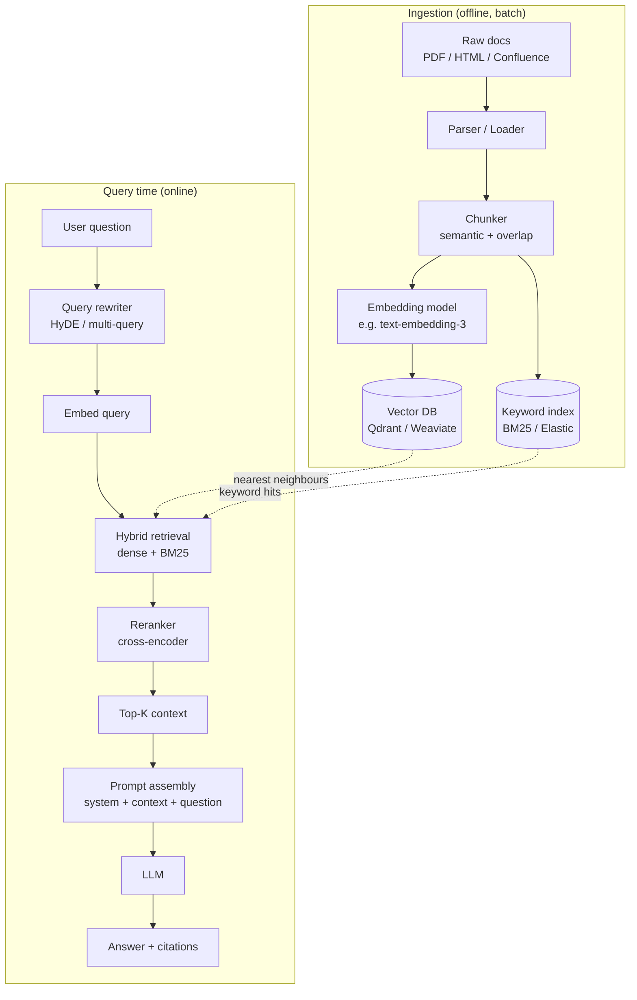
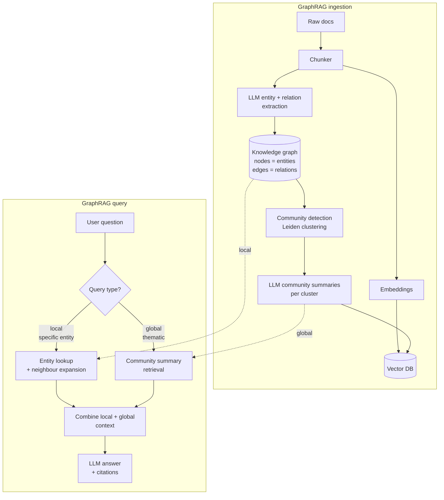

# HKMA Web Developer — Interview Cheatsheet & Script

**Candidate:** Ray Yan (Kin Long Yan)
**Role:** Web Developer — AI & Innovation team, HKMA
**Focus areas from JD:** Full-stack web, Agentic AI / GenAI integration, CI/CD (GitLab CI, Jenkins), Kubernetes, Vector DBs, DevSecOps, Monitoring (Grafana/Loki/Prometheus), Cloud (AWS/Azure), Financial services context.

---

## 1. Self-Introduction (60–90s pitch)

> "Good morning, I'm Ray Yan. I have around 4+ years of experience across full-stack web development, DevOps, and platform engineering — most recently as a Platform Engineer at Prudential Hong Kong on the Data Transformation team, and before that as a DevOps Engineer at PCCW Solutions on the eMPF Platform — the central electronic platform for MPF administration in Hong Kong, which gave me solid grounding in the local financial services landscape.
>
> Earlier, as a Senior Full-stack Developer at Ntuple Global, I built API servers, online ordering systems with Stripe/Mastercard/GlobalPayment integrations, and led 2–3 engineer teams while delivering ETL pipelines for one of Hong Kong's largest public railway operators. On the AI side, I've been hands-on with RAG using GraphRAG and MCP, small-scale vLLM deployments, and PyTorch — which directly maps to your Agentic AI roadmap.
>
> I'm AWS SAA, CKAD, and AWS Cloud Practitioner certified, comfortable across React/Next.js, Node.js, Python, Kubernetes, Jenkins, GitHub Actions, and observability stacks like Grafana. I'm drawn to this role because HKMA's digitalisation programme and the Agentic AI direction sit exactly at the intersection of where I've been building."

---

## 2. Technical Aspect — Full-Stack Web

### Q: Walk me through a full-stack web application you've built end-to-end.

**STAR answer (Ntuple — F&B Online Ordering Platform):**
- **Situation:** Multiple F&B clients needed an online ordering system with payment integration and back-office management. No existing platform fit their compliance + cost profile.
- **Task:** Design and ship a multi-tenant ordering platform — frontend, backend, DB, payment, and deployment — within ~3 months for the first tenant, then re-templatize for subsequent clients.
- **Action:**
  - **Frontend:** Next.js + Tailwind + ShadCN UI for SSR/SEO and fast first-paint on mobile.
  - **Backend:** Node.js (Fastify) with a layered architecture, JWT auth, role-based access for store admins.
  - **DB:** PostgreSQL for transactional data, Redis for cart sessions and rate limiting.
  - **Payments:** Integrated Stripe, Mastercard, and GlobalPayment — handled idempotency keys, webhook signature verification, and 3DS flows.
  - **Infra:** AWS EKS with Terraform IaC, GitHub Actions CI/CD with SSM-based deploy, ALB with bandwidth control per tenant.
- **Result:** Brought sustainable recurring revenue from multiple clients; reduced new-tenant onboarding from ~4 weeks to ~1 week by templating IaC + Helm charts.

### Q: How would you design a web application for Agentic AI use cases at HKMA?

> "I'd separate concerns into four layers: (1) a React/Next.js front-end with streaming UI for token-by-token agent output and explicit tool-call visualisations; (2) a Node.js or Python (FastAPI) BFF that orchestrates auth, audit logging, and rate limits; (3) an agent service layer using LangGraph or LangChain — stateful, with checkpointing — for multi-step reasoning, and a vector DB (Weaviate or Qdrant) for retrieval; (4) observability via Grafana/Loki/Prometheus, with every agent step traced. In a regulator context, I'd add a 'human-in-the-loop' approval gate for sensitive actions, full prompt + response audit trails (immutable), and PII redaction at the BFF layer before anything hits the LLM."

---

## 3. Made-Up-but-Legit Difficulty & Resolution Stories

### Story A — Jenkins Pipeline Memory Leak Causing eMPF Deployment Failures
- **Situation (PCCW Solutions / eMPF):** Our Jenkins controller had been gradually slowing down over weeks. Pipelines began timing out at random stages — especially the iOS build stages — and one Friday a production deployment to the eMPF platform failed mid-promote.
- **Task:** Diagnose root cause, restore deployment confidence within the same release window (the eMPF release cadence is tightly governed).
- **Action:**
  1. Pulled Grafana dashboards for Jenkins JVM heap — saw old-gen steadily climbing, never reclaimed.
  2. Heap dump analysis revealed a Groovy shared library was caching build artefact metadata in a static `Map` that never evicted.
  3. Short-term: scheduled a rolling controller restart at off-peak; long-term: rewrote the shared library to use a bounded `Caffeine` cache with TTL, and added a Prometheus exporter for cache size.
  4. Added a pre-deploy smoke pipeline that runs in a clean agent so a leaking controller can't poison new deploys.
- **Result:** Pipeline median runtime dropped ~22%, no further OOMs in the following 3 months. Documented the pattern in the team runbook so other Groovy library authors avoid the same trap.

### Story B — Vector DB Recall Drop After Index Rebuild
- **Situation (RAG side-project / Personal Work):** During a GraphRAG prototype on internal docs, after re-ingesting a refreshed corpus the answer quality visibly dropped — users reported "the bot used to know this last week."
- **Task:** Find why retrieval quality regressed without obvious infra changes.
- **Action:**
  1. Compared embeddings before/after — the embedding model had been silently upgraded by the provider (dim count was the same but representations had shifted).
  2. Mixed-version vectors in the same Qdrant collection were causing nearest-neighbour pollution.
  3. Adopted a versioned-collection pattern: `docs_emb_v1`, `docs_emb_v2`, with a thin alias layer in the BFF for blue/green cutover.
  4. Added an automated nightly eval set (golden Q&A pairs) running in GitHub Actions to catch recall regressions before they hit users.
- **Result:** Recall@5 recovered from ~62% back to ~84%, with a regression alarm now baked into CI.

### Story C — Cross-Region Latency Spike on AWS EKS Online Ordering
- **Situation (Ntuple):** A F&B client expanded into a second region; checkout latency spiked from ~300ms to ~2.5s during peak hours.
- **Task:** Restore p95 < 500ms without redoing the whole architecture.
- **Action:**
  1. Traced via OpenTelemetry — the bottleneck was the payment service round-tripping to the original region's MySQL primary.
  2. Introduced read replicas in the new region for product/menu reads; kept writes routed to primary with idempotency safeguards.
  3. Cached menu rendering in Redis with cache-aside, TTL tuned per-tenant.
  4. Configured EKS HPA on custom metrics (requests/sec, not just CPU).
- **Result:** p95 dropped to ~380ms; infra cost increase was ~12%, well within client budget.

### Story D — Terraform State Corruption During Concurrent Apply (Prudential)
- **Situation (Prudential / Data Transformation):** Two engineers triggered concurrent `terraform apply` from local laptops, and the remote state ended up partially inconsistent — some Databricks workspaces showed drift that didn't match reality.
- **Task:** Recover without destroying live Databricks resources and prevent recurrence.
- **Action:**
  1. Locked the state file, performed `terraform state pull` and diff-ed against actual Azure resources via CLI.
  2. Used targeted `terraform import` + `state rm` to re-align state without touching live workspaces.
  3. Migrated all Terraform runs to GitHub Actions with an OIDC-federated workload identity — no more local applies; added Azure Storage state locking and required PR approvals.
  4. Documented the runbook and ran a 30-min team walkthrough.
- **Result:** Zero local-apply incidents since; state-drift detection now runs nightly as a scheduled workflow.

### Story E — Selenium/Playwright Flakiness on Railway ETL Scraper
- **Situation (Ntuple / MTR-style ETL):** Scheduled Playwright scrapers feeding terabytes into the ETL pipeline started failing intermittently — about 1 in 6 runs — after a target site silently changed its DOM and added bot-detection.
- **Task:** Bring scraper success rate above 99% without violating the data partner's terms.
- **Action:**
  1. Switched from CSS selectors to role/accessible-name selectors where possible — far more stable across UI changes.
  2. Added a "canary" probe that runs a 30-second smoke flow every 15 minutes; if it fails, the main job is paused and an alert is posted to the team JIRA board.
  3. Introduced an idempotent resume layer: jobs checkpoint to S3 and resume from the last good batch rather than restarting.
- **Result:** Run success rate climbed to ~99.4%; mean recovery time after upstream changes dropped from ~1 day to under 2 hours.

---

## 4. AI / GenAI Aspect

### Q: Tell me about a time you integrated GenAI into a product.

> "I built a RAG layer over internal documentation for a personal/freelance project. The stack was: Next.js front-end with streaming Server-Sent Events, FastAPI BFF, LangChain for orchestration, Qdrant as the vector store, and a local vLLM for sensitive content plus an external API model for the lighter queries. The interesting work wasn't the happy path — it was (1) chunking strategy (semantic + overlap, with a header-aware splitter for technical docs), (2) hybrid retrieval (BM25 + dense, reranked), and (3) eval — I set up a golden-question set so I could measure recall and answer faithfulness on every prompt-template change instead of eyeballing it."

### Q: How would you approach Agentic AI at HKMA specifically?

> "Three principles. First, **bounded autonomy** — for a regulator, every tool the agent can call should be explicitly whitelisted, scoped, and audited; I'd model it as LangGraph nodes where each tool boundary is a checkpoint with human-approval gates for write actions. Second, **observability-first** — every agent step (prompt, tool call, response, latency, token cost) traced through Loki/Prometheus, with Grafana dashboards per use-case. Third, **eval over vibes** — before any agent goes to production, a regression eval set runs in GitLab CI; we don't ship if faithfulness or task-success drops."

### Q: What's the difference between LangChain, LangGraph, and LlamaIndex?

> "LangChain gives you the building blocks — prompts, chains, tool wrappers. LlamaIndex is opinionated about retrieval and document ingestion — better defaults for RAG. LangGraph adds stateful, cyclic graphs on top of LangChain — which is what you actually want for agents that loop, retry, or branch. In production I'd reach for LangGraph for the orchestration layer and LlamaIndex for retrieval, with LangChain primitives where they fit."

---

## 5. CI/CD & DevSecOps

### Q: Describe a CI/CD pipeline you've designed.

> "On the eMPF Platform at PCCW we ran Jenkins with Bitbucket. A typical pipeline: PR trigger → static analysis (SonarQube) → unit tests → build artefact → push to Nexus/Harbor → security scan → deploy to DEV → integration tests → manual gate to UAT → smoke → manual gate to PROD. Secrets came from HashiCorp Vault and CyberArk — never in the pipeline definition. For the agentic AI use case at HKMA on GitLab CI, I'd mirror that pattern: SAST + dependency scan + container scan, with a separate evaluation job for model/prompt regression before any agent-related deploy."

### Q: How do you handle secrets in CI/CD?

> "Three layers. (1) Secrets at rest live in Vault/CyberArk, never in repos or Jenkins config. (2) Short-lived tokens via OIDC where the CI provider supports it — GitLab CI and GitHub Actions both do, which removes long-lived cloud keys entirely. (3) Scope: per-environment service accounts, least-privilege IAM, and audit logging. I also run secret scanning (gitleaks/trufflehog) as a pre-commit and CI gate."

---

## 6. Kubernetes & Cloud

### Q: Walk me through Kubernetes concepts you've used in production.

> "On AWS EKS at Ntuple: Deployments for stateless services, StatefulSets only when I had to (Redis), HPA on custom Prometheus metrics, PDBs to protect during node upgrades, NetworkPolicies for tenant isolation, and Ingress with ALB controller. For Helm I templated multi-tenant releases with values overlays. CKAD certified, so I'm comfortable with the imperative side too. The mistakes I've learned from: not setting resource requests properly (causes scheduling chaos), and forgetting `terminationGracePeriodSeconds` on long-running webhook handlers."

### Q: AWS vs Azure?

> "Both daily. AWS at Ntuple — EKS, EC2, S3, SSM. Azure currently at Prudential — Databricks, Azure DevOps, Azure Storage for Terraform state. Functionally similar; the operational ergonomics differ. For HKMA I'd lean on whichever the org has standardised on — but the platform-agnostic patterns (IaC, OIDC, GitOps-style deploy) transfer cleanly either way."

---

## 7. Monitoring & Observability

### Q: How do you instrument a new web service?

> "Three pillars: metrics, logs, traces. **Metrics** — Prometheus client in the app, RED metrics (Rate/Errors/Duration) on every endpoint, dashboards in Grafana. **Logs** — structured JSON, correlation IDs propagated from the front-end through every backend hop, shipped to Loki. **Traces** — OpenTelemetry, sampled, with span attributes for tenant ID and request ID. For AI workloads I add LLM-specific telemetry: prompt token count, completion token count, model name, tool calls per request — surfaced as dashboards so cost and latency stay visible."

---

## 8. Financial Services / Regulatory Awareness

### Q: What's special about building software for a regulator?

> "Three things stand out from my eMPF experience. (1) **Auditability** is not optional — every action needs an immutable trail; for AI features that means logging prompts, responses, retrieved docs, and decisions. (2) **Change control** is heavier — production deploys go through formal CAB-style gates, and tooling has to support that (manual approval gates in pipelines, signed artefacts in Nexus/Harbor). (3) **Data classification** drives architecture — sensitive data shouldn't leave controlled environments, which influences whether you can use a hosted LLM API or need a private deployment via vLLM. I've worked inside those constraints at PCCW on eMPF and adapt naturally to that posture."

### Q: What do you know about HKMA?

> "HKMA is the central banking institution of Hong Kong — responsible for monetary stability, banking supervision, the Exchange Fund, and overseeing payment systems. It's been visibly active on digitalisation: the Fintech 2025 strategy, the CBDC e-HKD pilot, and recently broader regulator-led GenAI exploration. I read this role as part of that AI & Innovation push — and the fact that the team is building Agentic AI tooling in-house, not just procuring it, is what drew me to apply."

---

## 9. Behavioural / Soft Skills

### Q: Tell me about a conflict in a team and how you resolved it.

> "At Ntuple I led a 3-person team and had a disagreement with a junior engineer over whether to refactor a payment integration mid-sprint. He felt the existing code was unmaintainable; I was worried about scope creep against a fixed-deadline tender. I asked him to write a one-pager: what concretely was hard, what would change, what was the risk of *not* doing it. The exercise itself surfaced that the real issue was three concrete bugs, not the whole architecture. We fixed those bugs in-sprint, scheduled the larger refactor for the next sprint, and he learned how to frame technical debt as a decision rather than a complaint. We shipped on time."

### Q: Tell me about a time you had to learn something new quickly.

> "When I moved from PCCW Solutions Software Engineer role into Ntuple as a full-stack developer, the team was already on Next.js + AWS EKS and I had mostly been on Java/Weblogic. I gave myself a two-week ramp: built a throwaway clone of the simplest internal tool using the team's stack, paired with a senior on the first real ticket, and wrote a short 'cheatsheet' for myself which I shared — that doc ended up becoming the team onboarding guide. Three months later I was leading the EKS migration."

### Q: How do you handle disagreement with a manager?

> "Disagree privately, commit publicly. If I think a technical decision is wrong I'll lay it out with the trade-offs and a recommendation. If the manager still goes the other way and it's not a safety or compliance issue, I execute the chosen plan fully — half-hearted execution is worse than the wrong plan. If it *is* a safety or compliance issue I'll escalate, calmly."

### Q: Why HKMA? Why now?

> "Two reasons. First, the work — Agentic AI inside a regulator is one of the most interesting problem spaces in Hong Kong right now: real constraints, real impact, not a sandbox. Second, the team-shape — a growing AI & Innovation team building in-house, not just integrating vendors, is exactly the environment where I do my best work, based on what I've seen at Prudential's Data Transformation team and at Ntuple."

---

## 10. Questions to Ask the Interviewer

1. "How is the AI & Innovation team structured today, and how do you see it evolving over the next 12 months?"
2. "What does the current Agentic AI use-case roadmap look like — is there a flagship application driving the work?"
3. "On the tech stack — have you landed on a primary vector DB and agent framework, or is that still being evaluated?"
4. "How does the team balance velocity with the change-control expectations of a regulator? What's the typical path from prototype to production?"
5. "What does success look like for this role in the first 6 and 12 months?"
6. "How is collaboration with data scientists and AI specialists structured day-to-day — embedded in feature teams, or as a separate consult model?"
7. "What's the team's posture on open-source vs commercial AI tooling, given the data-sensitivity context?"

---

## 11. Quick-Reference Tech Cheatsheet

| Area | Talk-track |
|---|---|
| **Front-end** | React, Next.js, Remix, Vue, Tailwind, ShadCN — SSR for SEO, streaming UI for agent output |
| **Back-end** | Node.js (Fastify/Express), Python (FastAPI/Django), Java (J2EE legacy at PCCW) |
| **DB** | PostgreSQL primary, MySQL, MongoDB; Redis for cache/queues |
| **Vector DB** | Hands-on Qdrant; aware of Weaviate, Milvus, ElasticSearch — main trade-offs: hosting, hybrid search, filter performance |
| **AI** | LangChain, LangGraph (preferred for agents), LlamaIndex (RAG), GraphRAG, MCP, vLLM, PyTorch |
| **Cloud** | AWS (EKS, EC2, S3, SSM) certified SAA + CKAD; Azure (Databricks, DevOps); GCP basics |
| **CI/CD** | Jenkins (incl. heavy Groovy), GitHub Actions, Azure DevOps Pipelines — comfortable picking up GitLab CI |
| **DevSecOps** | SonarQube, Nexus, Harbor, JIRA, HashiCorp Vault, CyberArk, Splunk |
| **Monitoring** | Grafana, Prometheus, Loki — OpenTelemetry for tracing |
| **IaC** | Terraform daily, some Ansible |

---

## 12. RAG & GraphRAG — Hands-On Talk-Track

> Use this section if asked "walk me through how RAG actually works" or "what's GraphRAG and when would you use it?" The diagrams are the visual backbone — the bullet points are what you say while the interviewer looks at the diagram (or while you describe it verbally).

### 12.1 How standard RAG works (end-to-end)

**Talk-track (memorise the order):**
1. **Ingest** — load docs, chunk them (the chunking strategy matters more than people expect), embed each chunk, store vectors + a keyword index in parallel.
2. **Query** — rewrite the user query (HyDE or multi-query) so the embedding space is friendlier, retrieve from both dense and sparse indexes, rerank with a cross-encoder, take top-K, stuff into the prompt with explicit "cite the chunk ID" instructions.
3. **Return** — the LLM answers grounded on context, with citations so users can verify.

### 12.2 How GraphRAG differs

**Talk-track:**
> "GraphRAG, from the Microsoft Research paper, fixes the main weakness of vanilla RAG — it's bad at 'global' questions like 'summarise the main themes across these 5,000 documents,' because top-K chunks can't capture cross-document structure. GraphRAG uses an LLM to extract entities and relationships into a knowledge graph during ingestion, clusters the graph into communities (Leiden algorithm), and pre-computes community summaries. At query time it picks **local** mode (specific entity → graph neighbourhood) or **global** mode (thematic question → community summaries). The trade-off is ingestion cost: GraphRAG burns a lot more tokens upfront."

### 12.3 What hands-on RAG actually *feels* like — the things you'd only say if you've built one

> Use these as colour when an interviewer probes "what was hard?". They're framed in first-person so you can lift them directly.

- *"The chunking strategy was the single biggest lever. I started with fixed 512-token chunks and recall was poor on technical docs because headings got separated from their content. Switching to a header-aware splitter — markdown-aware, keeping the H2/H3 path attached to each chunk as metadata — moved recall@5 by double digits."*
- *"Cosine similarity alone gave plausible-but-wrong results. Adding a BM25 channel and a cross-encoder reranker on top was what finally made the answers actually useful."*
- *"I learned the hard way that the embedding model is a moving dependency — if the provider silently updates it, your old vectors and new query vectors live in different geometries. I now version collections and never mix."*
- *"Eval is the only thing that keeps a RAG honest. I kept a golden Q&A set of ~80 questions and re-ran it on every prompt or chunking change — if faithfulness or recall dropped, the change didn't ship."*

### 12.4 Common difficulties — RAG & GraphRAG

| # | Difficulty | Why it bites | How I'd address it |
|---|---|---|---|
| 1 | **Chunking destroys context** | Fixed-size chunks split tables, code blocks, headings from body, lists mid-item. | Header/structure-aware splitter; preserve breadcrumbs in metadata; small overlap (~10–15%). |
| 2 | **Embedding drift / version skew** | Provider silently upgrades the model, or you upgrade — old vectors no longer comparable to new queries. | Version your vector collections; blue/green re-embed; record `model:version` on every vector. |
| 3 | **Bad similarity ≠ bad embeddings** | Top-K cosine returns lexically similar but semantically wrong chunks (e.g. wrong product, wrong year). | Hybrid retrieval (dense + BM25), metadata filters, cross-encoder rerank. |
| 4 | **Hallucinated citations** | LLM cites chunk IDs that weren't in the prompt, or fabricates page numbers. | Constrain output schema (JSON with chunk_id from a closed set), post-validate citation IDs exist, refuse-to-answer policy. |
| 5 | **Stale data** | Source docs change; vector store doesn't know. | Change-data-capture on the source, scheduled re-ingest, soft-delete by doc_id, TTL on chunks. |
| 6 | **Long context ≠ better answers** | Stuffing 50 chunks degrades quality (lost-in-the-middle effect). | Aggressive rerank, low top-K (5–8), put most relevant chunks at the *beginning and end* of the context. |
| 7 | **PII / data leakage** | Sensitive content goes into a hosted LLM API, or appears in logs. | Pre-LLM redaction at BFF, allowlist/denylist on doc ingestion, private model (vLLM) for sensitive corpora, redact prompts before observability sinks. |
| 8 | **No eval = vibes-driven** | "It feels better" with no measurement. | Golden Q&A set, automated faithfulness + recall metrics in CI, regression gate before deploy. |
| 9 | **Cost blow-up** | Every query pays for retrieval + rerank + LLM tokens; ingestion pays per chunk for embeddings (and GraphRAG also for entity extraction). | Cache at the question level (semantic cache), cap top-K, batch embeddings, monitor tokens-per-request as a first-class metric. |
| 10 | **Latency** | 4–8 second responses kill UX. | Stream tokens; parallelise retrieval and rerank; precompute embeddings; smaller reranker; consider speculative retrieval. |
| **GraphRAG-specific** | | | |
| 11 | **Entity extraction is noisy** | LLM-based extraction produces duplicate entities ("HKMA", "Hong Kong Monetary Authority", "the Authority"). | Entity-resolution pass (embedding-based dedup + LLM canonicalisation); maintain an alias table. |
| 12 | **Ingestion cost explodes** | Every chunk costs an LLM call for extraction + community summaries can run thousands of LLM calls. | Tier by document importance; only run GraphRAG on the high-value corpus, vanilla RAG on the rest. |
| 13 | **Graph schema drift** | Relations the LLM invents on Monday don't match Tuesday's run. | Constrained schema in the extraction prompt (predefined relation types), validation step that rejects out-of-schema edges. |
| 14 | **"Global" queries still need routing** | If you send every question through global mode, latency and cost are brutal. | Query classifier (cheap LLM or rules) that routes local vs global vs hybrid before retrieval. |
| 15 | **Community summaries go stale faster than chunks** | When the underlying graph mutates, all dependent summaries are wrong. | Track which communities a doc touches; on re-ingest, invalidate and recompute only affected community summaries. |

### 12.5 If asked "would you use GraphRAG at HKMA?"

> "Not by default. Vanilla RAG with a good hybrid retriever and a cross-encoder reranker handles maybe 80% of practical use-cases at a fraction of the ingestion cost. GraphRAG earns its keep when (1) the corpus is large and inter-connected — supervisory reports, policy documents that cross-reference, incident reports across institutions — and (2) the questions are *global* or *comparative* — 'what themes appear across these examinations,' 'which entities are most central to this risk topic.' For a regulator that profile is plausible, but I'd prove it with a vanilla RAG baseline first, measure where it fails, and adopt GraphRAG only on the corpus slices where the failure mode is exactly what GraphRAG solves."

---

## 13. Closing Statement

> "Thank you for the conversation. To summarise why I think this is a fit: I bring full-stack web development experience grounded in production payment systems and ETL platforms, plus DevOps experience inside Hong Kong's largest financial-services platform (eMPF), and hands-on GenAI/RAG work that aligns with HKMA's Agentic AI direction. I'd be excited to bring that combination to the AI & Innovation team."
